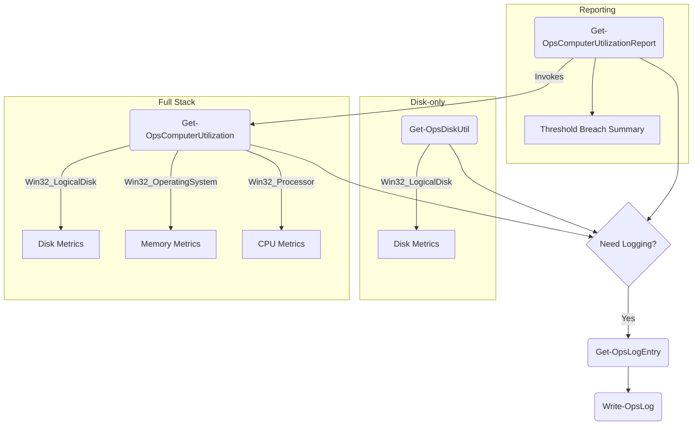

# ModuleScenario Documentation

## Overview
ModuleScenario is a minimal PowerShell module that currently exposes three public cmdlets: `Get-OpsDiskUtil` (per-volume disk metrics), `Get-OpsComputerUtilization` (disk + memory + CPU overview), and `Get-OpsComputerUtilizationReport` (threshold-based alerting). It also contains private helpers responsible for structured logging so future public commands can emit consistent telemetry.

```
ModuleScenario/
├── ModuleScenario.psm1          # Module entry point
├── ModuleScenario.psd1          # Module manifest metadata
├── Public/
│   ├── Get-OpsComputerUtilization.ps1      # Aggregate disk + memory + CPU metrics
│   ├── Get-OpsComputerUtilizationReport.ps1 # Threshold-based reporting
│   └── Get-OpsDiskUtil.ps1                 # Disk-focused cmdlet exported to consumers
└── Private/
    └── Write-OpsLog.ps1         # Private helpers (Get-OpsLogEntry, Write-OpsLog)
```

## Prerequisites
- Windows PowerShell 5.1+ or PowerShell 7+
- Execution policy permitting script/module execution (`Set-ExecutionPolicy RemoteSigned` for development)
- Network access to remote hosts when using `-ComputerName`

## Build Workflow
1. **Restore workspace**
  ```powershell
  git clone -b ec-module https://github.com/ecaha/polyglot.git
  cd polyglot/ModuleScenario
  ```
2. **Run module tests (optional)** – add Pester tests under `tests/` when available.
3. **Package the module**
  ```powershell
  $moduleRoot = (Resolve-Path .).Path
  $distPath   = Join-Path $moduleRoot 'dist'

  New-Item -ItemType Directory -Force -Path $distPath | Out-Null
  Copy-Item -Path (Join-Path $moduleRoot 'ModuleScenario.psd1'), \
              (Join-Path $moduleRoot 'ModuleScenario.psm1'), \
              (Join-Path $moduleRoot 'Public'), \
              (Join-Path $moduleRoot 'Private') \
         -Destination $distPath -Recurse

  Compress-Archive -Path (Join-Path $distPath '*') -DestinationPath (Join-Path $moduleRoot 'ModuleScenario.zip') -Force
  ```
4. **Increment version** – update `ModuleVersion` inside `ModuleScenario.psd1` prior to publishing.

## Deployment
- **Local import for testing**
  ```powershell
  Import-Module -Name (Resolve-Path .\ModuleScenario) -Force
  Get-Command -Module ModuleScenario
  ```
- **Per-user installation**
  ```powershell
  $target = Join-Path $env:USERPROFILE 'Documents\PowerShell\Modules\ModuleScenario'
  Copy-Item -Path .\ModuleScenario -Destination $target -Recurse -Force
  ```
- **System-wide installation** (requires elevation)
  ```powershell
  $target = 'C:\Program Files\PowerShell\7\Modules\ModuleScenario'
  Copy-Item -Path .\ModuleScenario -Destination $target -Recurse -Force
  ```

## Internal Architecture


### Public Components
- **Get-OpsDiskUtil**
  - Parameters: `-ComputerName` (array, pipeline-aware) **or** `-PSSession` (accepts session objects from the pipeline).
  - Central script block collects `Win32_LogicalDisk` data (local disks only) and formats hostname, timestamp, capacity, free space, and utilization.
  - Emits per-target errors so failed computers/sessions are clearly identified while successful targets continue streaming results.
  - Ready for future logging calls (e.g., wrap WMI calls with `Write-OpsLog`).
- **Get-OpsComputerUtilization**
  - Parameters mirror `Get-OpsDiskUtil` (`-ComputerName` or `-PSSession`).
  - Reuses a single script block to gather disk, memory (`Win32_OperatingSystem`), and CPU (`Win32_Processor`) data and enrich each disk row with `MemoryTotal/Free/Util(%)` and `CpuTotal/Free/Util(%)` columns.
  - Handles division-by-zero scenarios gracefully and surfaces per-target errors so mixed success/failure scenarios are easy to triage.
- **Get-OpsComputerUtilizationReport**
  - Wraps `Get-OpsComputerUtilization` and lets operators set per-metric thresholds (defaults: Disk 85%, Memory 90%, CPU 80%).
  - Accepts the same targeting parameters (`-ComputerName` or `-PSSession`) and emits one object per breach with host, metric, observed percent, threshold, and a descriptive message plus raw data for further analysis.
  - When no breaches occur, returns a summary object indicating "No utilization issues detected" so downstream automation can distinguish clean runs from missing data.
  - Ideal for scheduled monitoring jobs that only need to forward actionable exceptions instead of full telemetry.

### Usage Examples
```powershell
# Disk-only view across two servers
Get-OpsDiskUtil -ComputerName 'srv-core-01','srv-db-02'

# Enriched computer utilization via pipeline input
'srv-core-01','srv-db-02' | Get-OpsComputerUtilization

# Alert on threshold breaches (custom CPU limit)
Get-OpsComputerUtilizationReport -ComputerName 'srv-core-01','srv-db-02' -CpuUtilizationThreshold 70

# Reuse established remote sessions for any cmdlet
Get-PSSession -Name 'Prod*' | Get-OpsComputerUtilizationReport
```

### Private Components
- **Get-OpsLogEntry**
  - Inputs: `-LogLevel`, `-Message`, optional `-Hostname`, `-Timestamp`.
  - Normalizes level to upper case, formats ISO 8601 UTC timestamp, and concatenates into `"<timestamp> <level> <host> <message>"` for ingestion by log processors.
- **Write-OpsLog**
  - Parameter sets:
    - `Components`: accepts `-LogLevel`, `-Message`, `-LogFile` and internally calls `Get-OpsLogEntry`.
    - `Entry`: accepts pre-built `-LogEntry` with `-LogFile` for reuse across commands.
  - Ensures target directory/file exists, then appends the entry. Returns the written text for downstream validation.

## Extending the Module
1. Place future public cmdlets inside `Public/` and ensure they call logging helpers when emitting diagnostic data.
2. Private utilities (formatting, network helpers, etc.) belong in `Private/` to keep the exported surface minimal.
3. Update `ModuleScenario.psd1` with new metadata (dependencies, tags, description) as the module grows.
4. Add Pester tests to `tests/` and wire into CI.

## References & Useful Links
- [PowerShell Modules Overview](https://learn.microsoft.com/powershell/scripting/developer/module/ps-modules)
- [Create a PowerShell Module Manifest](https://learn.microsoft.com/powershell/module/microsoft.powershell.core/new-modulemanifest)
- [Publish-Module to PowerShell Gallery](https://learn.microsoft.com/powershell/scripting/gallery/how-to/publishing-packages/publish-module)


## Future Enhancements
- Add centralized configuration for log paths and retention.
- Replace deprecated `Get-WmiObject` with `Get-CimInstance` for cross-platform support.
- Introduce telemetry toggles (verbose, quiet modes) and unit tests verifying logging side-effects.
